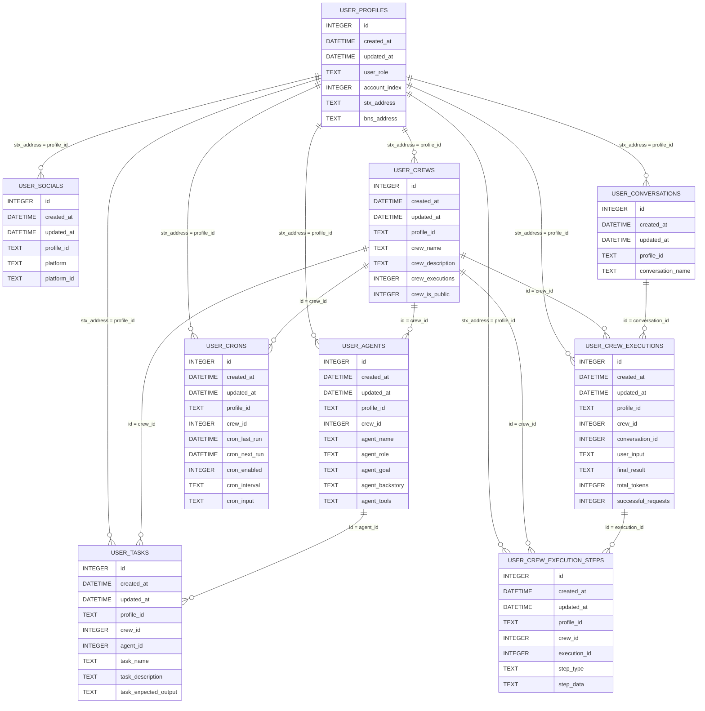

# AIBTCDev Database Overview

This database manages data about users, their crews of AI agents, tasks, and associated executions. Each table links back to a `user_profiles` entry, using `stx_address` as a unique profile identifier.

## Core Concepts

- **User Profiles** (`user_profiles`): The root of all relationships. Each user has a `stx_address` that links to their crews, agents, tasks, etc.
- **Crews** (`user_crews`): Groups of AI agents associated with a user. This table keeps track of crew details and execution counts.
- **Agents** (`user_agents`): Individual AI agents belonging to a crew. Each agent has a role, goal, backstory and optional tools.
- **Tasks** (`user_tasks`): Tasks assigned to agents, containing instructions and expected outputs.
- **Conversations** (`user_conversations`): Conversations representing ongoing interactions between users and their crews.
- **Crew Executions** (`user_crew_executions`): Records of each crew run, linking user input to a final result.
- **Crew Execution Steps** (`user_crew_execution_steps`): Detailed logs of steps taken during each crew execution (thoughts, actions, tool outputs).
- **Socials** (`user_socials`): Tracks user accounts on external platforms.
- **Crons** (`user_crons`): Defines scheduled executions for crews (interval, next run time, etc.).

All tables have:

- A primary `id`
- Timestamps (`created_at`, `updated_at` updated by triggers)
- Foreign keys linking to `user_profiles` and other related tables
- Indexes on frequently queried columns

## Building Endpoints

Endpoints are stored in `src/database/helpers`. When creating endpoints, follow this pattern:

1. **Initialize ORM**: Start by setting the ORM instance for the target model. The durable object initializes the ORM with the D1 database and it is passed to all DB helpers.
2. **Base Queries**: Perform base queries on primary entities (e.g. `user_profiles`, `user_crews`) using `where` clauses and `orderBy` for sorting.
3. **Expand Related Data**: For more detailed endpoints, query related tables by passing `where` conditions referencing `profile_id`, `crew_id`, or `agent_id`.
4. **Assemble Results**: Combine results from multiple queries to return a structured response (e.g. crew info + associated agents + tasks).

Example:

- To get enabled crons with all related data:
  - Fetch enabled crons from `user_crons`.
  - For each cron, fetch the corresponding crew, agents in that crew, tasks for each agent, and the associated user profile.
  - Return a combined payload.

This structure allows endpoints to remain consistent, testable, and easily expandable.

## Database Structure

[View on mermaid.live](https://mermaid.live/edit#pako:eNrFVl1v2jAU_SuRn2lFKAltpD2g1qvQOqhIulUTUmSSC40a7MwfHYzy3-eErzgFhNqu5Y1zfW_OPbbP9RxFLAbkIeBXCRlzMhnQAb3zcT-87fe-dm6wb80H1NK_TjfA17hvJfHy_1U7wEHnO7YiDkRCHBJZCagsNgIBvg8sJYCHnKVgViVRxBSVYUJjmJaWCzkNSRxzEKKEDqnYoosNZb932WnfvDfjjLNRkkK4LrMEUyJHjE92QMXCLanLPv75IZR0iT8hJROoYjGIiCeZTBg1WRRRmEKk8pjYEUxEmKlhmkTljtrXuBv875ZMGuU-yRj0Qak0ugS356oEjhlJX4BDEj0KyfjsRUQylhqnKmj73z6l283dKHgZGkgiHqsSFNiLvd6GYJpBlDNhSmZKGme01_2B-3476PS6H3NWGX0CLkjOc9WHeWNCfI8v7z6Cz0HpDZ5GB4WPJbQQcgOOEkrSUNuSSqVZSDKpI5I9QvWeCRVF2sdGKk_8rUBIsV-M0A_w7acqsrELUw4hIQvlLIMqpr9HzH4-aUtLtTX5lAhtF4ruilGYlmLbYjoElAxTMF03l4JK4E-GzazwykXbDNXn55MTNreMseVZA1Sad9aXcmPoUIXljHl9_srRX19g6ZFvaMAwoLcJUbaO96q0undvKXcMHePJsGeDklinrU822pux3ZEjE3ZJ96rUklZH5-_74M75dBzrinOjvePl-E4M70PV99AB9TcTXCehGpoAn5Ak1s_uwgcHSD6AHoEoXx_DiOTTQ69c6KVESebPaIQ8yRXU0NL_Vm_1NZgR-oux8l_kzdEUeSe2e9ps2q1Gwzm_aNTrbsutoRnyWvXThtOynXPbrp85jussauhvUcE-tW33zL1w607dbZ5dNGqIMzV-QN6IpAIW_wCf0eWC)
